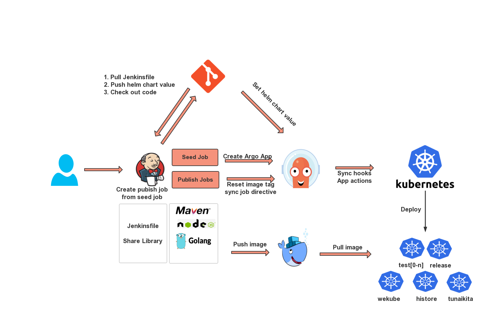
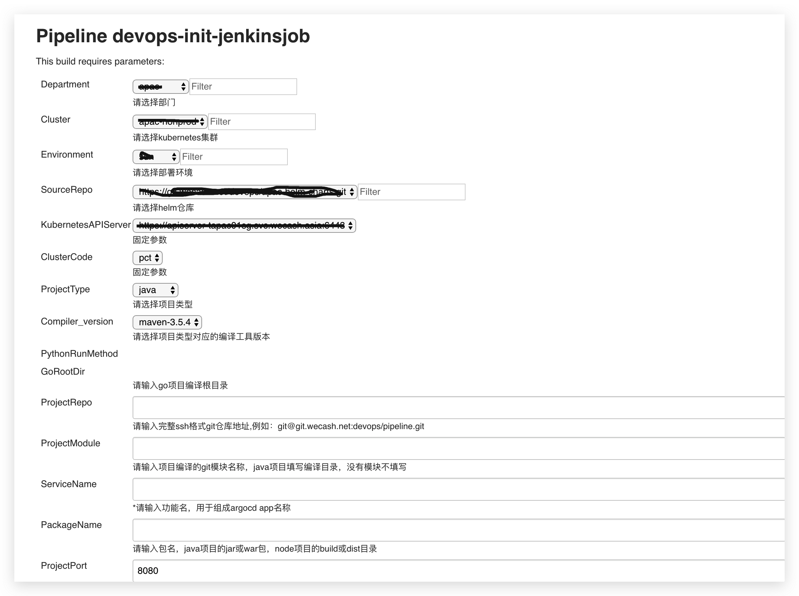

## Get Started

> 本套发布cicd工具链应用于kubernetes服务发布，通过jenkins的pipeline，使用jenkinfile和argocd实现了对业务服务的打包、镜像制作推送和部署。借助于jenkins参数化功能，将项目信息选择和填写入参数后执行既可生成一个部署链。

#### requirements

- Jenkins 2.121+

- [argocd v1.1.1+](https://github.com/argoproj/argo-cd/releases/tag/v1.1.1)

- helm chart template

- harbor repository

- kubernetes

- docker

<font face="微软雅黑" color="blue" size="4">注：本文不包含jenkins和argocd的部署</font>

#### Architecture




#### 仓库信息

- Helm chart: `https://github.com/wayne-beep/helm-chart-template.git`

#### 1.  创建初始化jenkins job

jenkins创建统一pipeline类型初始化job（有必要为初始化job新建view。job名称，例：devops-init-jenkinsjob），使用`pipeline script from SCM` 模式的Git项配置初始化pipeline仓库地址

- SCM：Git
  - Repository URL：`git@github.com:wayne-beep/pipeline.git`
  - Branch Specifier ：*/master
  - Credentials可统一使用id(例如)：devops

- Script Path: init/jenkinsfile_initjob

配置完执行空build会自动执行jenkinsfile中的参数化语句，变成一个参数化的job，且可以看到job的左侧菜单栏多出*Build with Parameters*选项

#### 2. 配置**Global Pipeline Libraries**

jenkins > Manage Jenkins > Configure System > Global Pipeline Libraries 中配置全局pipeline共享库

- Name：填写wekube-shared  *该名称会被jenkinsfile的首部分@Library('wekube-shared@master') _使用，因此如果使用其他名称，请做相应的jenkinsfile调整* 
- Default version： master
- Retrieval method：选择Modern SCM
- Source Code Management：选择Git
  - Project Repository：`git@github.com:wayne-beep/pipeline.git`

参数解释：

- Allow default version to be overridden：允许覆盖默认版本，即jenkinsfile中的共享库设置版本会覆盖此处的设置。如果不勾选，且jenkinsfile中配置了version后构建会报错，不允许覆盖版本
- Include @Library changes in job recent changes：库中的任何改变，都会包含在构建的更改集中，即只要共享库内容修改，就会应用于jenkins的构建中无论是新构建还是rebuild或replay。如果不勾选，则新的更改只会应用于新的构建中，rebuild或replay还是会取源构建的内容。

#### 3. 填写信息生成发布job

jenkins job *devops-init-jenkinsjob界面点击*Build with Parameters*，跳转填写参数化信息页面(截取一部分)：



填写完成信息后，点击build按钮，执行pipeline流水线。完成如下操作：

1. 参数判断，git仓库的组或者project没有填写将退出流程
2. 设定一些系统变量
3. 创建以[部门]为view（view自动配置以部门为前缀的正则匹配）
4. 创建以[部门]-[git组]-[环境]为名称的folder
5. 创建以[部门]-[集群代号]-[环境]-[应用名]为名称的该folder下的jenkins pipeline job
6. 创建并推送helm chart values文件
7. 创建argocd application

## Design

整套CICD流程的宗旨在于设计一套尽量减少人工干预，只要正确输入项目信息既可通过该流程的流水线完成发布job所依赖的信息创建。每个服务一个job。避免多人分散操作，实现配置的统一管理。

#### 1. 初始化流水线job

初始化流水线job作为seed job，在CICD流程之前执行，用于生成目标项目的可执行流水线job以及CICD过程中所应用到的信息创建。

##### 1.1. 参数化job

利用jenkinsfile的parameters功能，通过pipeline syntax语法中的Set job properties，就像在free style job中创建参数化一样设置所需要的参数，参数使用了大量的Active Choices 插件提供的参数实现了参数联动，部分参数为动态参数，通过接口动态获取数据。完成后执行Generate Pipeline Script 生成jenkinsfile语法，复制到jenkinsfile中既可。该功能的好处是可以统一管理参数，避免人为的创建和修改。当有参数更新时，需要空跑一次加载新增参数。

##### 1.2. 创建jenkins pipeline job

创建jenkins job的过程，会预先创建view和folder（如果已存在，则操作被忽略）。使用[jobdsl](https://jenkinsci.github.io/job-dsl-plugin/)语法（安装job-dsl-plugin插件）创建jenkins job，当job已存在时重新执行或者命名冲突会覆盖已有job，jenkins默认保留构建历史。创建的job会固化一些参数，Jenkinsfile为统一的模板，通过调用参数来进行项目编译和部署。

##### 1.3. 创建helm chart的values文件

项目部署通过helm chart管理，在chart公共git仓库中，包含不同项目类型的chart模板目录（java、go、node，都以目录形式存在），由于chart的values文件是yaml类型的，因此利用jenkinsfile的readYaml功能，读取项目的values.yaml文件，将目标value修改为参数传入value后在通过writeYaml功能写入以[部门]-[模块]-[环境]-values.yaml为名称的文件到对应项目类型的目录中。**必须与values.yaml文件为相同路径**，因为在argocd中无法找到其他层级的values文件。生成values文件的功能在share library库中，由jenkinsfile直接调用库，传入要修改的参数即可使用。

生产文件后，由jenkinsfile将修改的仓库推送到gitlab，用于argocd创建application时调用。

##### 1.4. 创建argocd application

完成values文件的生成后，就要通过argocd客户端来创建项目的app了，创建app的前提是argocd中已创建对应的cluster、project和repository以及kubernetes集群中的namespace（目前这些需要手动创建）

```shell
argocd app create ${ArgoAppName} \
  --values ${HelmChartValueName}-values.yaml \
  --repo https://git.xxxxxx.net/devops/devops-charts-template.git \
  --dest-server ${KubernetesAPIServer} \
  --dest-namespace ${K8sNamespace} \
  --project ${Department} \
  --path ${ProjectType} \
  --upsert \
  --grpc-web \
  --insecure
```

其中包含一些关键的参数，在本文中都会有讲解。该创建app的功能在share library中，由jenkinsfile传入参数调用。

完成application的创建，初始化job流水线的任务也就完成了。

#### 2. 发布job流水线

发布job流水线是由初始化job生成的，用于执行ci过程的job

##### 2.1. 从数据库调取项目信息备用

jenkinsfile共享库方法执行接口调用，以jenkins job名称为key从数据库中取得项目所有信息存储为json格式，该步骤在最开始执行，后续各个stage需要的信息全部从json中取得。

##### 2.2. checkout 代码

```shell
checkout([$class: 'GitSCM',
    branches: [[name: "${VERSION}"]],
    doGenerateSubmoduleConfigurations: false,
    extensions: [
    	[
        $class: 'CloneOption', 
        depth: 1, 
        reference: '', 
        shallow: true, 
        timeout: 60
      ],
      [
        $class: 'SubmoduleOption', 
        disableSubmodules: false, 
        parentCredentials: true, 
        recursiveSubmodules: true, 
        reference: '', 
        trackingSubmodules: false
      ]
    ], // 
    gitTool: 'Default',
    submoduleCfg: [],
    userRemoteConfigs: [[credentialsId:"${paramsJson.department}",url: "${paramsJson.projectRepo}"]]
])
```

上面的git checkout参数中对拉取代码做了一些优化：

- depth结合shallow 使git只拉取最近一层的提交，有些项目可能由于人为操作不利，上传了较大的文件，如果不使用该参数会将所以版本历史全部拉取，导致拉取时间过长。
- SubmoduleOption 子模块支持，有些项目带有子模块，用该功能可以拉取

##### 2.3. 生成Dockerfile

做为部署到k8s中的应用，需要把服务构建产物做成docker image后被使用，那么就需要通过Dockerfile将代码编译后的产物打到Docker镜像里。针对不同类型的项目，使用不同的Dockerfile模板，根据传入的信息修改其中的关键参数生成一个临时Dockerfile到代码的根路径或者是模块内（根据项目是多模块还是无模块）。该功能包含在共享库中，Dockerfile的模板存在于共享库的resources/dockerfiles目录中便于调用。修改模板封装了Groovy的GStringTemplateEngine（流式处理文件）方法在共享库的src/org/file目录中。

##### 2.4. 执行编译和镜像打包推送

拉取代码后，会根据项目类型来执行对应的编译方式，常见的有maven，npm，cnpm。该功能包含在共享库中，在jenkinsfile中调用。编译完成后执行docker buid打包镜像，镜像仓库使用harbor，每个部门使用一个目录，名称为Department参数传入的部门名称，镜像名称使用git仓库的名称或者是模块名（根据项目是否有模块）（镜像名称将调整为application的名称），tag号的组成为[jenkins构建号]-[7位commitid ]，加入jenkins构建号是为了保证每次发版都会更新kubernetes部署，需求场景如下:

- 用户仅仅是想重启服务
- 用户引用第三方包，第三方包代码更新但是内部代码没有更新，此时git仓库没有新的commit

##### 2.5. argocd执行部署

在上一步新的镜像tag制作完成后，通过argocd客户端，设置目标application的image tag为刚刚打包的tag，然后执行sync操作将最新的修改同步到kubernetes中来更新deployment，deployment通过rollingupdate的方式发布重启pod。

#### 3. Jenkins Share Library

> 文档：<https://jenkins.io/zh/doc/book/pipeline/shared-libraries/>

Jenkins的共享库解决了Jenkinsfile代码复杂、冗余、不便于批量修改的问题，将job公共的功能提取出来，通过共享库统一管理维护，便于参数修改，版本变更。同时也使得主线Jenkinsfile更加简洁，清晰。共享库调用函数文件存放在/var 目录中，以.groovy后缀结尾，名称为驼峰式，首字母小写。支持pipeline的declaractive语法，需要定义执行函数，默认为call函数，可以自定义函数名。为了使代码更易读，使用传参的方式调用共享库中的方法。
├── resources
│   ├── dockerfiles
│   │   ├── goDockerfile
│   │   ├── javaDockerfile
│   │   ├── nodeDockerfile
│   └── sonarqube
│       ├── sonar-project-nomodule.properties
│       └── sonar-project.properties
├── src
│   └── org
│       └── file
│           └── GStingTemplateToFile.groovy
└── vars
    ├── argoDeploy.groovy
    ├── checkJobExists.groovy
    ├── createArgoApp.groovy
    ├── createDockerfile.groovy

- resources目录存放共享库需要调用的文件
- src目录存放共享库需要调用的方法
- vars目录存放的是真正在jenkinsfile中调用的模块

#### 4. 共享helm chart模板

argocd通过helm chart进行部署，在`https://github.com/wayne-beep/helm-chart-template.git`仓库中，包含 java go node 等目录，分别用于不同语言的通用模板，Jenkinsfile会根据填入的参数，装载对应的项目目录中的values.yaml文件生成一个新的唯一识别项目名称的values文件，argocd在创建app的时候需要指定git仓库的目录以及配置文件。

## 命名规范

### 1. 命名规范

- namespace：kubernetes命名空间。命名规范 [部门]-[环境]

- application：argocd应用实例，是真正可以部署项目到k8s的资源。命名规范  [部门]-[集群代号]-[环境]-[功能]

注意：功能命名是需要创建应用者（一般是运维工程师）手动填写的，具有对项目的唯一标识的名称，在同一个部门内，不允许有不同的服务使用相同的功能名称（目前还没有做校验，后续完善），该名称的制定，需要运维可研发共同完成。

## Argocd

> 官方文档：https://argoproj.github.io/argo-cd/

Argocd服务在整个流程中起到CD作用，通过argo application，像指定的k8s集群和namespace中持续部署pod。Argocd的重要概念：

- Repositories：设置需要使用的helm chart的git仓库地址，计划每部门一个，相关运维人员自己维护
- Clusters：设置k8s集群信息，使用kubernetes的config上下文，通过命令行cli创建
- Project：项目，每个部门创建一个项目，一个项目可以设置多个k8s集群和namespace，也可以设置多个chart仓库源。项目中存储applications，application在创建的时候，需要指定项目、集群、namespace等信息。project命名规范为部门唯一名称，例如C端consumer，资方平台capital。
- Application：由mainfest定义的一组kubernetes资源，指定了helm chart仓库使用的模板目录以及values文件，创建于project内，用于发布应用到kubernetes。

## User Guide

#### 用户使用操作以及准备

用户使用该流程之前，需要准备以项目信息和规划应用配置

git仓库地址：仓库地址包含组和仓库名  [研发]

项目发布的包名（java: [jar|war],node: [build|dist]）[研发]

项目使用的模块：该模块为git仓库中需要部署模块的目录，用于打包编译和镜像制作 [研发]

确定项目application名称 [研发-运维]

项目接入apollo统一配置管理 [研发]

项目接入prometheus暴露监控指标（jvm、业务等）[研发]

项目日志接入elk系统 [研发]

确定kubernetes的namespace名称并创建，argocd中project添加集群和目标namespace [运维]

为namespace创建拉取镜像的secret 名称统一harbor[运维]

准备健康检测接口 [研发]

java服务确认好内存设定值 [研发-运维]

是否启用对外访问（ingress），如果启用，确认域名地址 [研发-运维]


#### 参数解释

初始化job任务会生成一个参数化的job，使用者需填写参数来生成用于项目发布的job，项目参数定义：

- Department：String 部门

- ProjectEnv：String 项目环境，生产、测试、预生产

- ProjectType：String 项目类型，java、node、go等
- ProjectTypeVersion：String 关联参数ProjectType，选择代码编译工具的版本
- GoRootDir：String 仅在ProjectType类型为go的条件下生效，设置为go项目的编译根目录
- GitGroup：String git项目所属组
- GitProject：String git项目名
- ProjectModule：String 项目模块，大部分java项目会包含很多子项目，该参数为子项目的目录。如果不包含子项目，此项为空
- ProjectPackage：String 包名，java项目编译后的jar或war包名称。前段项目需填写编译后的静态页面目录（dist、build等）
- ProjectPort：Integer 端口，用于服务启动端口和k8s的service暴露端口
- ServiceReplicaset：Integer 设置启动pod副本数量，默认1
- ApolloMeta：String Apollo config service地址，关联参数ProjectEnv，列出对应环境的地址
- HealthCheck：是否需要健康检测（决定livenessProbe和readinessProbe是否开启）
- HealthCheckUrl：String 健康检查接口，默认为 /
- JVM：String 关联参数ProjectType，java项目需填写堆内存信息，格式：512M
- Ingress：Boolean 是否需要域名访问
- Hostname：String 关联参数Ingress，设置访问域名
- InterfacePath：String 关联参数Ingress，设置反向代理接口
- Service：是否启用k8s service，当Ingress启用时，该项为true；当Ingress关闭时，该项可选true或false
- ServiceName：如果Service启用，需要设置service name，如果为空，则默认为部署版本名
- KubernetesAPIServer：String 选择对应k8s集群的api接口地址
- ArgoAddr：String 选择目标argocd地址
- SonarScan：String 是否开启sonarqube扫描，默认flase

初始化job以及发布job中需要的变量参数命名规则：

- JenkinsFolder：部门-git组-项目环境
- Module：项目模块名称，如果ProjectModule为空，设置为git项目名，否则等于ProjectModule
- CompileModule：用于编译项目指定的模块，如果Module为空则为空，否则等于ProjectModule
- ApolloEnv： Apollo的环境，包括FAT UAT PRO与ProjectEnv对应
- HelmChartValueName：生成的char文件的名称 部门-模块-项目环境 
- ArgoAppName：argocd app名称 部门-git项目名-模块-项目环境]
- K8sNamespace：k8s命名空间，用于创建argocd project、app 部门-项目环境
- Job名称：创建的job命名  部门-项目类型-git项目名-模块-项目环境
- RepoAddr：docker仓库，项目推送地址  harbor地址/部门
- GitCommitID：获取的git部署分支短commit号
- ImageTag：镜像标签  gitcommit号-jenkins构建号-项目环境
